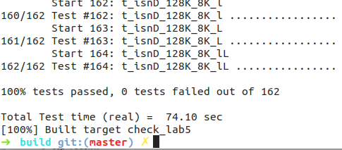
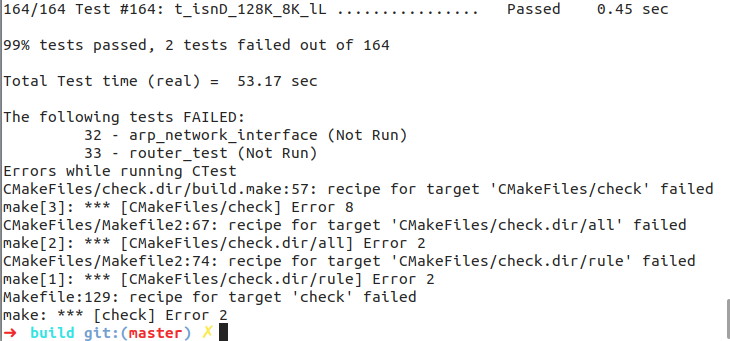
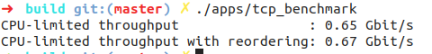

Lab 5 Writeup
=============

My name: [<font color="purple">刘轩昂</font>]

My Student number : [<font color="purple">201220198</font>]

This lab took me about [<font color="purple">50</font>] hours to do.

### 1. Program Structure and Design:

本次实验将通过实现模块`TCPConnection`来封装`TCPReceiver`和`TCPSender`，然后构建TCP的有限状态机；<br>
本次实验的难点主要是逻辑判断比较复杂，而且之前lab的实现漏洞可能无法被测试样例覆盖进而影响lab5。

### 2. Implementation:

添加的辅助变量和函数：
``` cpp
// tcp_connection.hh
    size_t _time_since_last_seg_received = 0;
    bool _active = true;
    void reset_connection(); //
    void send();
```
辅助接口函数实现：
``` cpp
// tcp_connection.cc
void TCPConnection::reset_connection() {
    TCPSegment seg;
    seg.header().rst = true;
    _segments_out.push(seg); // send RST

    _receiver.stream_out().set_error();
    _sender.stream_in().set_error();
    _active = false;
}
void TCPConnection::send() {
    // 给等待发送的数据包设置本地的ackno和window size
    while (!_sender.segments_out().empty()) {
        TCPSegment seg = _sender.segments_out().front();
        _sender.segments_out().pop();
        if (_receiver.ackno().has_value()) {
            seg.header().ack = true;
            seg.header().ackno = _receiver.ackno().value();
            seg.header().win = _receiver.window_size();
        }
        _segments_out.push(seg);
    }
    // 输入结束，关闭连接
    if (_receiver.stream_out().input_ended()) {
        if (!_sender.stream_in().eof()) {_linger_after_streams_finish = false;}

        else if (_sender.bytes_in_flight() == 0) {
            if (!_linger_after_streams_finish || time_since_last_segment_received() >= 10 * _cfg.rt_timeout) {
                _active = false;
            }
        }
    }
} 
```
实现代码比较长，在此只截取`segment_received()`的分类判断：
``` cpp
void TCPConnection::segment_received(const TCPSegment &seg) {
    if (!_active) return;
    // reset connect time
    _time_since_last_seg_received = 0;
    // if RST then set errors
    if (seg.header().rst) {
        ... //set error
    }
    // CLOSED/LISTEN
    else if (_sender.next_seqno_absolute() == 0) {
        ...
    }
    // SYN-sent
    else if (_sender.next_seqno_absolute() == _sender.bytes_in_flight() && !_receiver.ackno().has_value()) {
        ...
    }
    // SYN-Revd，input won't end
    else if (_sender.next_seqno_absolute() == _sender.bytes_in_flight() && _receiver.ackno().has_value() &&
             !_receiver.stream_out().input_ended()) {
                ...
    }
    // Established
    else if (_sender.next_seqno_absolute() > _sender.bytes_in_flight() && !_sender.stream_in().eof()) {
        ...
    }
    // Fin-Wait-1
    else if (_sender.stream_in().eof() && _sender.next_seqno_absolute() == _sender.stream_in().bytes_written() + 2 &&
             _sender.bytes_in_flight() > 0 && !_receiver.stream_out().input_ended()) {
                ...
    }
    // Fin-Wait-2
    else if (_sender.stream_in().eof() && _sender.next_seqno_absolute() == _sender.stream_in().bytes_written() + 2 &&
             _sender.bytes_in_flight() == 0 && !_receiver.stream_out().input_ended()) {
                ...
    }
    // Time-Wait
    else if (_sender.stream_in().eof() && _sender.next_seqno_absolute() == _sender.stream_in().bytes_written() + 2 &&
             _sender.bytes_in_flight() == 0 && _receiver.stream_out().input_ended()) {
                ...
    }
    // other statuses
    else {
        ...
    }
}
```


### 3. Test:



**make check**:



**测试速度**:


